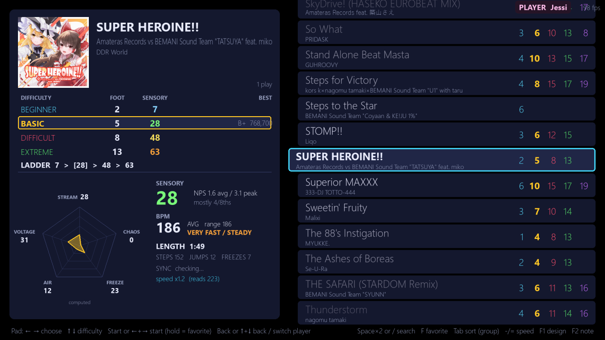
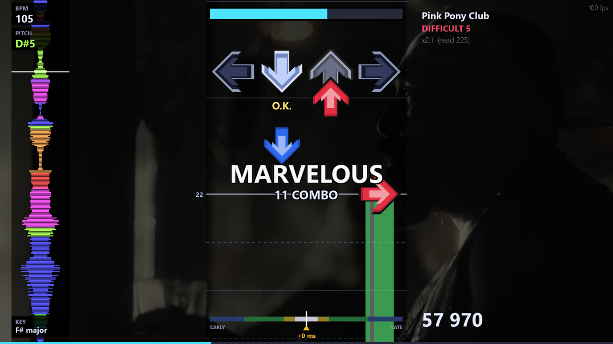
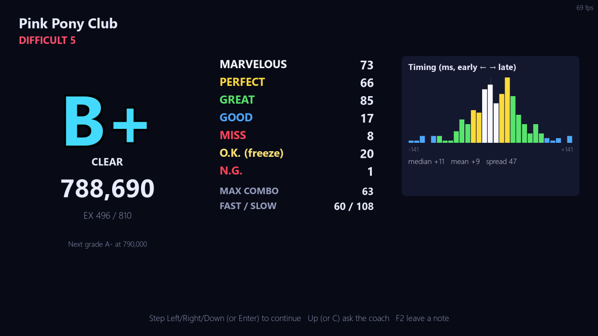
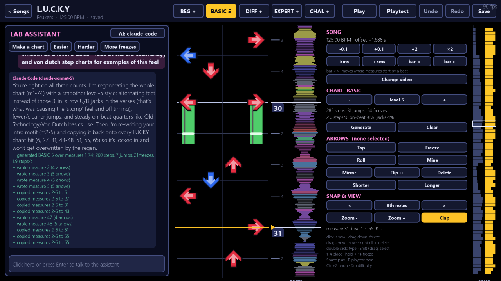
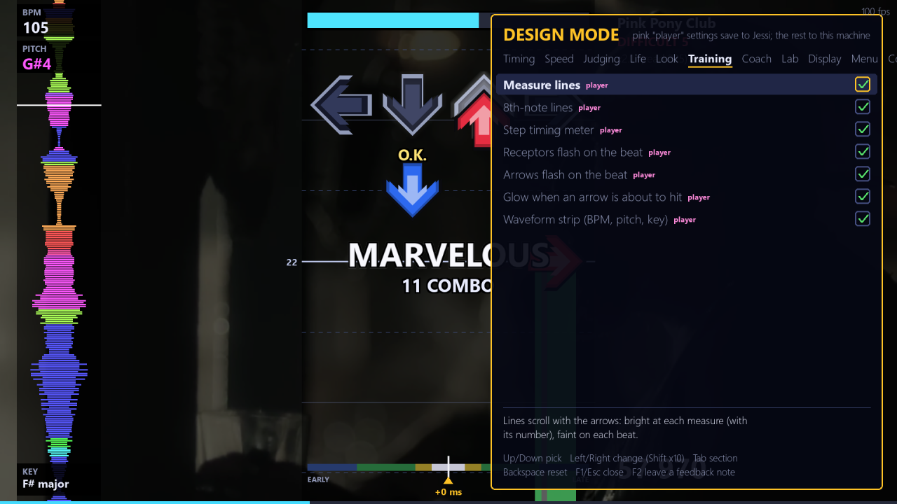
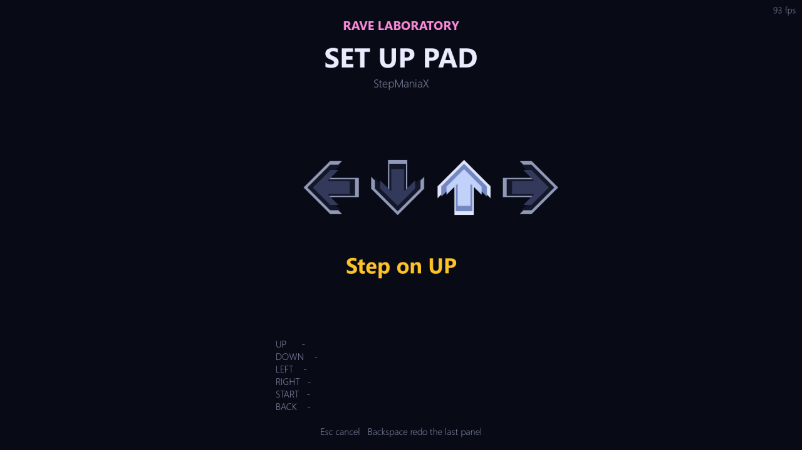

# Rave Laboratory

A dance game that plays the songs in your [Project OutFox](https://projectoutfox.com/) (StepMania) `Songs`
folder, written in Python. Windows, macOS and Linux.

**Status: early, not finished, looking for testers.** It has been played on one machine with one
StepManiaX pad. If you have a different pad, mat, adapter or OS, please try it and
[open an issue](https://github.com/LinuxJessi/rave-laboratory/issues) with what happened, good or bad.
Suggestions are welcome there too.

## Why

1. **Play closer to DDR World.** Arcade timing windows, the DDR A20/World money score, freeze grace, one read speed
   for every song, and per-song sync correction. OutFox's defaults are more forgiving; this is meant to feel like the
   arcade.
2. **Learn faster, with AI if you want it.** An optional coach reads your run (timing per rhythm, per panel, where the
   misses were) and gives three tips. Lab mode charts your own songs and music videos with an assistant. Both run
   through Claude Code (your Claude plan), the Claude API, or a local Ollama model. Nothing is sent unless you turn it on.
3. **Find songs and judge difficulty before you play.** Search from the pad, folders for favorites, most played and
   recently played, and a song panel with foot rating, Sensory score, groove radar, BPM and length for every chart.

## Screenshots

| | |
|---|---|
|  Song select: ladder, radar, BPM, your best |  Play: waveform strip, measure lines, video background |
|  Results: judgments and a timing histogram |  Lab mode: chart your own song with the assistant |
|  F1 Design Mode: every setting, live, mid-song |  Set up pad: step on each panel |

## Install and run

Download the package for your system from [Releases](https://github.com/LinuxJessi/rave-laboratory/releases).
Each one includes its own Python, so nothing else is installed.

1. Unzip it.
2. Move the `Rave Laboratory` folder into your Project OutFox folder, next to `Songs`. (Anywhere else works too; see
   *Where are my songs* below.)
3. Double-click:
   - Windows: `Rave Laboratory.exe`
   - macOS: `Rave Laboratory.app`. The first time, right-click it and choose Open.
   - Linux: `Rave Laboratory.sh`. If your file manager asks, choose Run.

The first start indexes every chart, about a minute per 2,000 songs. After that it is cached.

**From source** with your own Python 3.10 or newer:

```bash
python -m pip install -r requirements.txt
python ravelab.py
```

### Where are my songs

The game looks for OutFox in the folders above its own, then in Steam libraries and the usual install locations.
If it says "No songs found", point it at your OutFox folder once:

```bash
python ravelab.py --outfox "D:/Games/Project OutFox"
```

With the packaged version, run that as `runtime\python.exe ravelab.py --outfox ...` (Windows) or
`runtime/bin/python3 ravelab.py --outfox ...` (macOS, Linux). `--paths` prints what it found.

## Controls

The first screen is **Who's playing?**. Pick a player, then the song list.

| | Pad | Keyboard |
|---|---|---|
| Move through songs and folders | Left / Right (hold to scroll) | Left / Right; PgUp / PgDn jumps a folder |
| Change difficulty | Up / Down | Up / Down |
| Open a folder or start a song | Start, or Left + Right together | Enter |
| Favorite | Hold Start (or Left + Right) on a song | F |
| Back, close folder, switch player | Back, or Up + Down together | Esc |
| Quit a song | Stand on Up + Down for 2 s, or hold Back | Hold Esc for 1 s |
| Search | "Search songs" at the top of the list | Space twice, or `/` |
| Sort by group, level or title | | Tab |
| Settings, feedback note | | F1, F2 |

Pads with only four panels use the chords: Left + Right together is Start, Up + Down together is Back.

## Dance pads

Plug in the pad before or after starting. It is recognised in this order: bindings you saved in the game, your
OutFox `Keymaps.ini`, a table of known pads (StepManiaX, L-TEK, PlayStation and Xbox mats and adapters), then a
guess from what the pad reports. If none of that works, **Set up pad** opens by itself: step on Up, Down, Left,
Right, then optionally Start and Back. Open it any time from Who's playing? > Set up pad, or press P there.
Keyboard arrows and numpad 4 / 2 / 8 / 6 always work. Details: [docs/PADS.md](docs/PADS.md).

Only the StepManiaX stage has been tested. Reports from other pads are the most useful thing you can send.

## Timing

Two machine-wide settings correct your hardware's latency, both under F1 > Timing:

- **Judge offset**: when steps are judged. Play a song you know; the results screen suggests a value. Press O to apply it.
- **Arrow timing**: when arrows reach the receptors. Change it only if the arrows look off while the judging feels right.

They apply to every player on purpose: they correct the machine, not the person.

## Settings

Press **F1** on any screen, including mid-song. Up / Down picks a setting, Left / Right changes it, Backspace resets,
Tab changes section. Settings marked *player* (speed, life gauge, training aids, look) are saved with the current
player; the rest are per machine in `data/settings.json`, which can also be edited by hand while the game runs.

Training aids worth trying: measure lines, 8th-note lines, the step timing meter, receptor and arrow flashes on the
beat, and the waveform strip (loudness, pitch and key alongside the arrows).

## Players and OutFox scores

Each player has their own scores, favorites, history and settings. On first start, and whenever OutFox has been
played since, every OutFox local profile is imported: best scores become DDR money scores, play counts and favorites
come along. OutFox's files are only read, never written. Press I on Who's playing? to import again.

## AI coach and Lab mode (optional)

Both are off unless you turn them on under F1 > Coach and F1 > Lab. Providers:

- **Claude Code**: uses your Claude subscription. Install Claude Code, run `claude` once and sign in.
- **Claude API**: set the `ANTHROPIC_API_KEY` environment variable and `pip install anthropic`.
- **Ollama**: run Ollama locally; the first installed chat model is used.

The coach: on the results screen press Up (or C) for three tips based on your run's numbers.

Lab mode (Who's playing? > Lab mode): drop a song or music video on the window. The game copies it to
`Songs/Rave Lab/`, finds the BPM and beat grid, and the assistant makes a first chart. Then ask for changes in the
chat, or edit with the mouse: click to place an arrow, drag down for a freeze, right-click to delete, double-click to
change type. Press P to playtest from the cursor. Saved charts appear in the song list and in OutFox.

## Command line

| Switch | Effect |
|---|---|
| `--windowed` | Window instead of fullscreen |
| `--selftest` | No window: index the songs, print what was found, quit. Include this output in bug reports. |
| `--paths` | Print the folders in use |
| `--outfox PATH` | Use this OutFox folder |

Packaged version: `Rave Laboratory (console).bat --selftest` (Windows), `./Rave\ Laboratory.command --selftest`
(macOS), `./Rave\ Laboratory.sh --selftest` (Linux).

## Files

```
ravelab.py and *.py       the game; edit them and the changes run next launch
runtime/                  the bundled Python (packaged version only)
data/                     made on first run: settings, players, caches, design-notes.jsonl (F2), crash.log
docs/                     PADS.md, BUILDING.md
data-static/              DDR groove radar table, from the Project STARLiGHT theme
```

Delete `data/library-cache.json` to re-index; delete `data/` to reset everything.

## Building

`python build_release.py` builds every package from any OS. `build_frozen.py` is an alternative single-executable
build kept for comparison. Both are described in [docs/BUILDING.md](docs/BUILDING.md).

## Problems

- **No songs found**: run with `--paths`, then `--outfox`.
- **Pad does nothing**: Who's playing? > Set up pad. F1 > Controls shows what the pad sends when you press it.
- **Everything judged late or early**: play one song and press O on the results screen.
- **No video backgrounds or waveform**: ffmpeg was not found; `--selftest` shows where it looked.
- **macOS refuses to open it**: right-click > Open. If it still refuses: `xattr -dr com.apple.quarantine "Rave Laboratory"`.
- Anything else: `data/crash.log` and the `--selftest` output go in the issue.

## Thanks

Project OutFox and StepMania, for the engine, formats and song ecosystem this sits on top of. The Project STARLiGHT
theme for the Sensory rating formula and the groove radar data. pygame-ce, numpy, mutagen and imageio-ffmpeg.

Not affiliated with Konami, Project OutFox or StepManiaX. MIT licensed.
